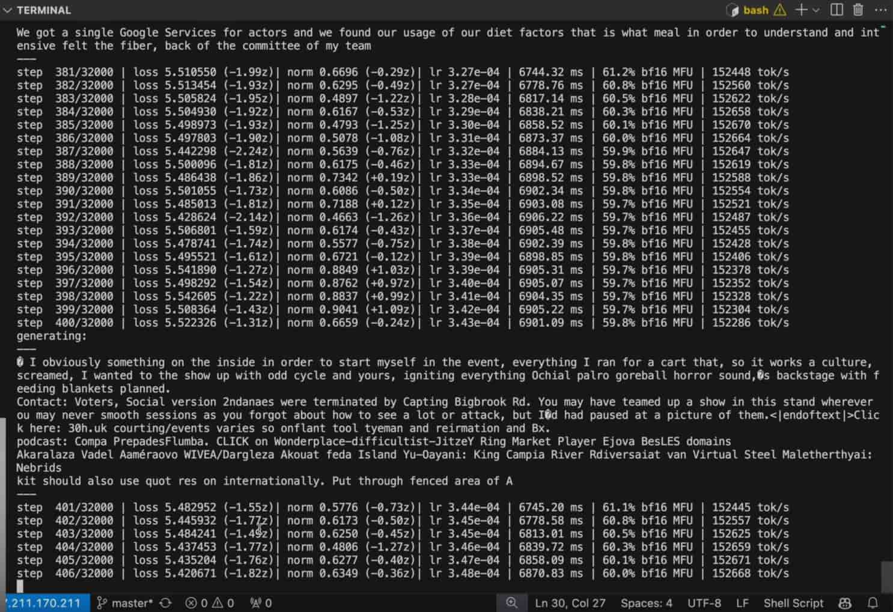
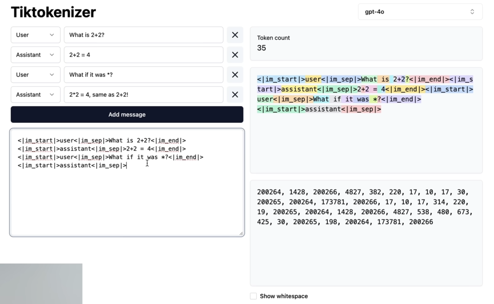
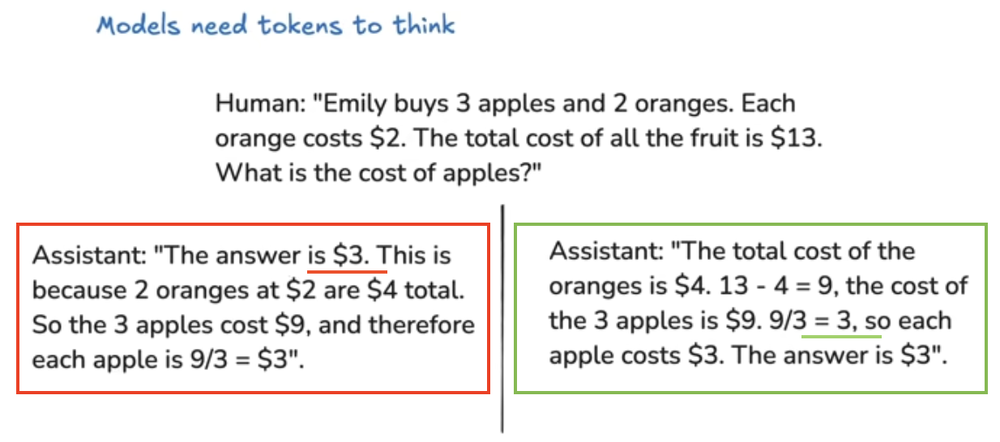
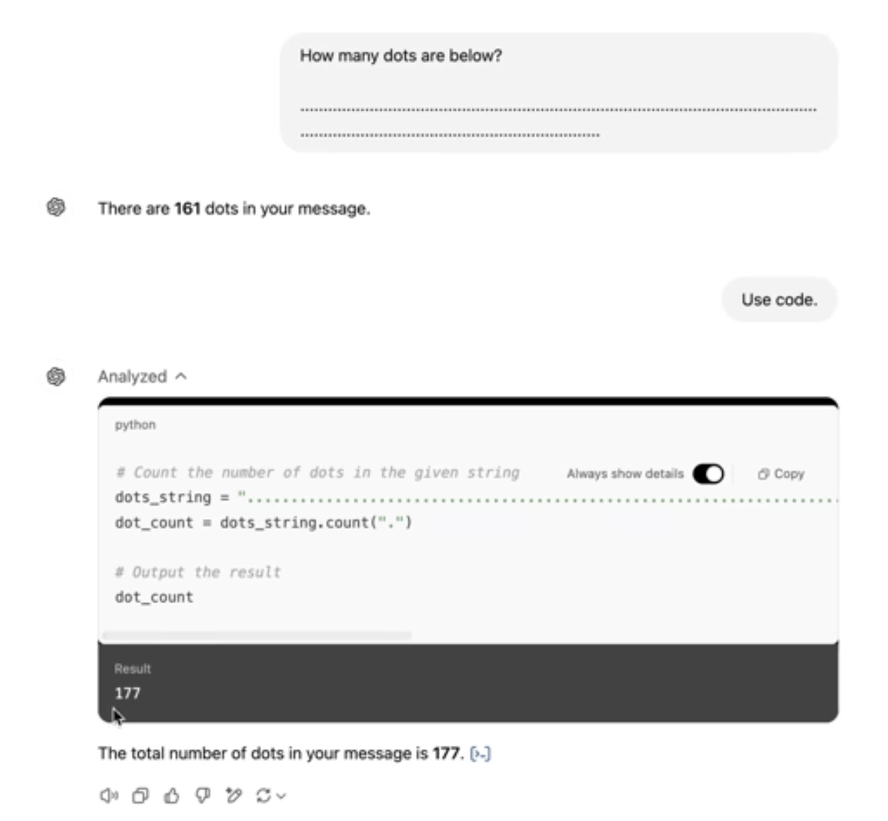
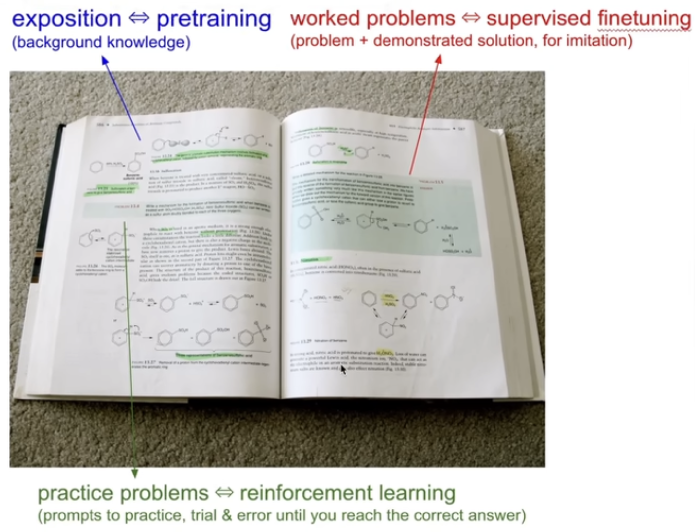
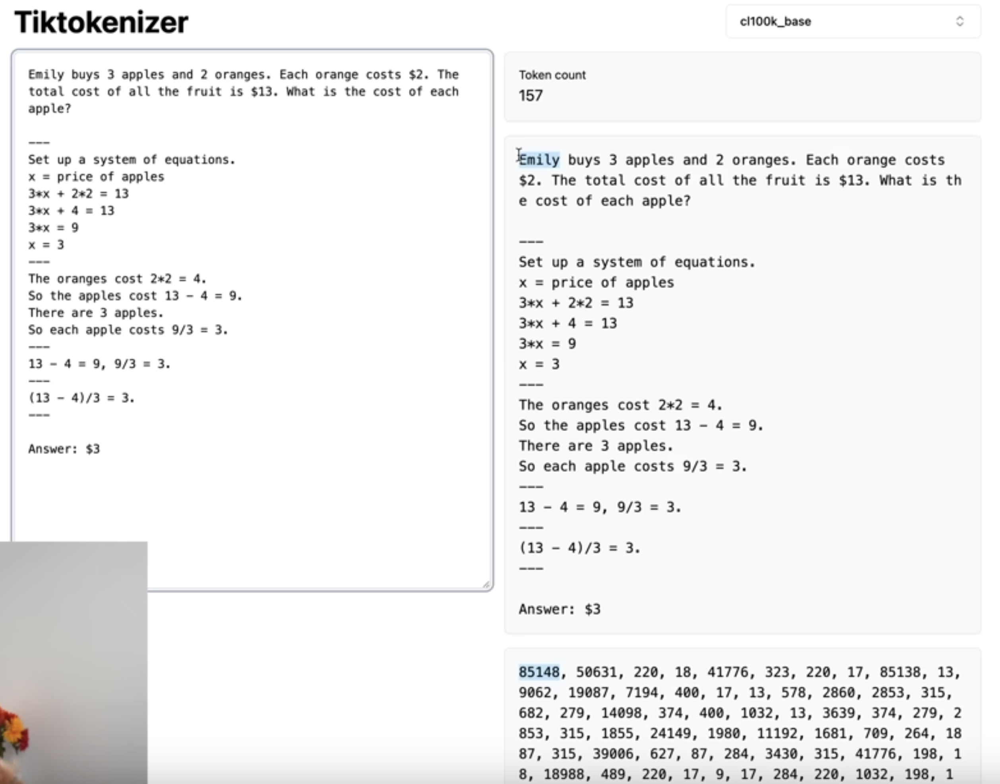

Reference [youtube video](https://youtu.be/7xTGNNLPyMI?si=sy8V2T4KwZjut7Ez).

There are three steps to build ChatGPT:

- Pre-Training
- Post-Training 
- Reinforcement Learning

## Pre-Training Stage

### Web Dataset 

**As the first step** download and preprocess the internet, use a web dataset like [Huggingface FineWeb](https://huggingface.co/spaces/HuggingFaceFW/blogpost-fineweb-v1) - Major LLM providers have something similar like this.  
Goal: Have a lot of knowledge inside models by having huge quantity, with high quality and with big diversity of documents. Interested on text only.

[CommonCrawl](https://commoncrawl.org) contributes to the web dataset by processing and analysing internet data. The verb used is *indexing* webpages. 
It works by starting with a few seed web pages and then follow all the links ∞.

Filtering the data happens through following steps:  
.

### URL-Filtering

Use [Blocklist](https://dsi.ut-capitole.fr/blacklists/) is list of domains, from which you don't want to get data in the model (like: marketing, racist, spam, malware sites).

### Text Extraction

Remove HTML markup code from website. Only text is needed.

### Language Filtering

Fineweb filters using a language classifier with the goal to guess which language every single page has been written. As a rule, they keep web-pages that have more than 65% of English, which is a design decision, that manipulate the results. i.e. by filtering Spanish out, the model will not be good at Spanish.

### PII Removal (Personal Identifiable Information)

Removing addresses, security numbers, ids, etc.

Find the [final Fineweb Dataset](https://huggingface.co/datasets/HuggingFaceFW/fineweb)

## Converting Text to Symbols for Neural Networks

**As a second step**. The Neuronal Network needs:
- A one dimensional sequence of symbols.
- A final set of symbols that are possible.

Behind the scenes, the text has UTF-8 encodings which are the raw bits that correspond to the text in the computer. Separating them to 1 byte (8 bits) helps to reduce the size of the list by 8 times and add more symbols (i.e. numbers and not only 0 and 1). Where the maximum possible numbers 0 - 255 (256).

### Byte Pair Encoding Algorithm (BPE)

 In production for LLM you want to continue shrink the length of sequence in return for more symbols in the vocabulary.

 It works by grouping consecutive bytes or symbols that are very common and creating a new symbol for it.
 E.g. ChatGPT4 uses 100277M symbols.

#### Tokenization

Is the process of converting from RAW text into symbols aka as tokens.

- Numbers of the tokens shall be seen as unique IDs.
- Merge the most common token pair to mint new tokens.
- The more symbol representation the better - i.e. the more condense the better.

Use [Tiktokenizer](https://tiktokenizer.vercel.app) to visualize tokens representations.

> ch100k_base is the GPT4 base model tokenizer.

## Neural Network Training

**As a third step**. the task is to model the statistical relationship on how the tokens follow each other in a sequence.

How: Take windows of tokens, i.e. a bunch of tokens (from the example data - fairly randomly). Decision from developers on windows range can be between 0 to maximum size of tokens. Andrej gave an example of 8000 tokens for a token window. 

> In principle we can use any arbitrary window length of tokens but processing long window sequences is very computational expensive.

As an example, following token IDs will be used - this is called the **context**: 

```
91 , 860   , 287  , 11579
"|", "View", "ing", "Single" 
```

**and the task is to predict what token comes next** 

```
91 , 860   , 287  , 11579     -----------> 3962
"|", "View", "ing", "Single" (in) NN (out)
```

The token length of the vocabulary is 100,277 -> there will be 100,277 different possibilities which are probable for each token. E.g.:

- Probability of token 19438 ("Direction"): 4%.
- Probability of token 11799 ("Case"): 2%.
- ...
- Probability of token 3962 ("Post"): 3%.

Since we sample this network from our dataset, we know that the next token is 3962. There is a way to mathematically calculate how to adjust the neural network so that the probability of 3962 will be higher and other tokes like 19438, etc. will be lower - **This process happens for the entire dataset at the same time**. 

After an update:
- Probability of token 19438 ("Direction"): 2%
- Probability of token 11799 ("Case"): 1%
- ...
- Probability of token 3962 ("Post"): **4%**

**This is the training process**! Is a sequence of **updating** it so that its **predictions match up the statistics of what actually happens in the training set**. Its **probabilities become consistent** with the **statistical patterns** of how these tokens follow each other in the data.

### Neural Network Internals

We have:

- Input sequence of tokens (**context window** e.g. between 0 and 8000 tokens).
- **Parameters aka "weights"** with usually billions of these (e.g.: 0.2, -0.5, 1.6, 0.8, 0.0, -0.9, ...) -> At the beginning these parameters are completely randomly set. Think of the parameters as the noobs from a music box.
- These are mixed up, in a giant mathematical expression. 

Because the parameters are random, the predictions are also random but with the process of training, the setting of parameters gets adjusted so that the output of the neural network becomes consistent with the pattern seen in the training set.

Example of a giant mathematical expression: 

```
1/(1 + exp(-(w0 *(1/(1 + exp(-(w1 * x1 + w2 * x2 + w3)))) + w4 * (1/(1 + exp(-(w5 * x1 + w6 * x2 + w7)))) + w8 * (1/(1 + exp(-(w9 * x1 + w10 * x2 + w11)))) + w12)))
```

x = inputs  
w = weights

> Task of the NN architecture researcher is to design effective math expression with the goal of being expressive, optimizable, parallizable, etc. 

An example of a production llm, and how it looks like:   
https://bbycroft.net/llm

## Inference 

- Continuously predicting from the distributions one token at the time by feeding back tokens and getting the next one, this generating new data from the model.
- Depending on how we sample from this probability distributions, we get different kinds of patterns. 

Task: Identify what kind of patterns it has internalized in the parameters of its network.   
How: Start with some tokens which are the **prefix**, e.g. start with token 91. 

```
                    NN  |   sample
91                  -->prob.------> 860
91, 860             -->prob.------> 287
91, 860, 287        -->prob.------> 11579
91, 860, 287, 11579 -->prob.------> 13659
```

- Flip a *bias* coin.
- Sample a token based on the probability distribution -> tokens that are getting higher probability by the model are more likely to be sample by flipping bias coin.
- Systems are stochastic! Always get different output. Sometimes we are getting token outputs that were not inferred in the training data - So, every time with different results but with a similar properties.

> In case of ChatGPT, what we get today is only inference. The training already happens many time before release. They have a specific set of weights that works well and not changed.

### Example of Training and Inference

Use OpenAI GPT-2. Transformer neural network - Andrej has a project in GitHub llm.c:
- 1.6 billion parameters - today llm have trillion parameters.
- Maximum context length of 1024 tokens (the context window - never exceed 1024).
- Trained on about 1B tokens.
- GPT = Generative Pretrained Transformer

#### Why is Training Getting Cheaper?  

Because the dataset got a lot higher quality - i.e. filter, extraction and preparation got refined and computers got much faster (hardware) and today's software use the hardware in a more optimized way. 

##### How Does the Training Look Like?



- The result after the training is called **Base Model**. A base model is a internet-text token simulator. Not enough for an assistant.
- Every single line is an update to the NN and updates the parameters by a little bit -> so that it's better at predicting the next token in a sequence.
- Every single line is improving the prediction of 1B tokens in the training set simultaneously.
- Loss number in the image indicates how well the NN is performing. Decreasing number is good!
- Each update of 1B tokens takes around ~6745.20 ms.
- Total of 32000 steps of optimization = ~33B tokens to process.
- Computation, the optimization is running in a [8XH100 node](https://www.nvidia.com/en-us/data-center/h100/), which is rented from https://lamdalabs.com.
- Why GPUs are great for training the NN? Achieve a lot of parallelism in the computation. Analogy of having many independent workers, working at the same time in solving the **matrix multiplication**.

The GPT2 is an open weight model, its release includes:

1. The python code, which describe the forward-pass of the NN, i.e. the sequence of operations in detail that they make in their model.
2. The parameter (1.5B) - The real value! Which are just numbers.

### Llama 3 (2024) - 405B Parameters Trained on 15 Trillion Tokens

- Meta released the **Instruct model** - Instruct corresponds to the **Assistant model**. Ask questions, give answers.
- Andrej gave an example on how the model is stochastic, and not able to give a correct answer - what is 2 + 2. The **base model** only repeats what often has written on the internet.
- The model kind of give a good approximations of answer by asking: *Here is my top 10 list of landmarks to see in Paris:*
- The model is extremely good at memorization, it can remember a lot from their parameters, as an example enters some text of the Zebra article from wikipedia and the base model completed with a lot of text which was 1:1 from the wikipedia site. This is bad and something not wanted in the final model - This is called **regurgitation**. This could probably happens when documents in the trainingset are of very high quality, like wikipedia sites. The decision often made is to train the model with samples from those sources. Assumption is that the base model has seen wikipedia sites way to ofter, like 10 times or more.
- Demonstrated the **few shot prompt** and that a base model can be utilized with practical applications because they have **in-context learning abilities**. E.g. gave 10 words like butterfly: name in korean, ocean: name in korean, etc. and teacher: - the model with in-context learning, gave the correct answer.
- Trick the base model to have assistant capabilities by giving a few shot prompt with input from human and from assistant.

## Post-Training Stage - Supervised Finetuning

### Conversations
- Take the base model and trained it further.
- Computation is much less expensive.
- Convert LLM model into an assistant.
- Assistant is programmed by example - with multi-term examples, i.e. multiple conversations between Human and Assistant. This data comes from human labellers.
- Give Human Labellers some conversational context and ask to give the ideal response in certain situations.
- Using the same algorithm as in pre-training but with conversations.

#### How

- Take the base model, which was trained in internet documents.
- Through away the internet documents.
- Substitute a new dataset with conversations.
- A model will adjust and learn the statistics on how this assistant responses to human queries.
- Then, during inference it would be possible to prime the assistant, get the response and it will imitate what humans labellers would do in that situation.

> Note: Training of Pre-trainer stage can take 3 months and massive computation. Pos-training 3 hours -> dataset of conversation is way smaller.

### Conversation Protocol / Format

- Goal: Turn conversations into token sequences.
  - Design an ending coding (analogy - TCP packets).
  - Have data structures with rules on how to encode and decode.
- Example, LLMs have special tokens: 
  - <|im_start|> = imaginary monolog start
  - [>user<] or [>assistant<] 
  - [|im_sep|] = imaginary monolog separation
  - The questions
  - <|im_end|>

All this masks are special tokens that gets added during the post-training stage. The goal is to give the model to know, hey this is the start of a turn for a user or an assistant, and this is what he says, and when it ends, etc.



The image above shows the special tokens that are sent to ChatGPT servers, also how ChatGPT construct a sequence of tokens, what special combination of words and symbols they use like [>assistant<] to "trick" it, so that the model will start to find the next best token, over and over.

### How Does a Dataset Look in Practice?

Taking as reference, the paper "[Training language models to follow instruction with human feedback aka InstructGPT](https://arxiv.org/pdf/2203.02155)" from OpenAI. This paper talks about how to take LLMs and fine-tune them on conversations.

#### Section 3.4 Human Data Collection From OpenAI Paper

- Hired human contractor from [Upwork](https://www.upwork.com/cat/ai/) and [ScaleAI](https://scale.com) to construct conversations.
- Human Labellers have the job to create conversations.
- 1. They are asked to come with prompts.
- 2. complete them with ideal assistance responses.
  - Ex. Best Sci-Fi movies to watch, or translate to Spanish, etc.
- OpenAI provides a labeling instructions for how the humans shall create ideal responses.
  - On high-level you are asking human labellers to be **helpful**, **truthful** and **harmless**.
- Labeling instructions could lead to big documents.
- Shall be answered professionally from labellers with a lot of knowledge.
- Example [OpenAssistant](https://huggingface.co/datasets/OpenAssistant/oasst1/viewer/default/train?row=0)
- The more assistant responses, the better, so that the model will response with similar vibe and with similar answers.
- Nowadays, for Supervised Fine-Tuning (SFT) models, i.e. what described above: Humans don't really do the labeling anymore, but LLMs itself, a good example is [UltraChat](https://github.com/thunlp/UltraChat).

### LLM Psychology 

- **Hallucinations**: When LLM makes stuff up and fabricate information.
  - Recent models don't suffer much from hallucinations anymore.
  - How recent models differentiate from things that they know or doesn't know? 
    - Hallucination aka **Factuality**, [The Llama 3 Herd of Models](https://arxiv.org/pdf/2407.21783) describes the procedure by which they **interrogate the model to figure out what they know and what not**. Then in the training set, add answers that the model doesn't know.
      - Mitigation 1. Interrogate the model by using LLMs to generate questions and answers from an article (e.g. Wikipedia's Dominik Hasek - hockey player), then interrogate the model for n times (3-5x) to answer the question, if the model doesn't answer the question, then in the training set, as answer it will be written. Sorry I don't remember, sorry I don't know.
        - After doing this for many types of questions and documents, in the training set, the model will be able to refuse to say based on its knowledge.
      - Mitigation 2. Allowing the model to refresh their memory by using tools. Emit a mechanism to introduce special tokens that a model can use. E.g.: ```<SEARCH_STRAT>Who is Orson Kovacs?<SEARCH_END>```. During inference, when the model sees the special token, it stops inference and open a session with bing.com, then get the text from the search result and paste it in the context window.
    - **Context windows**: is the working memory of the model and it's the information which is inside the chat session. This data is directly accessible by the model and feeds into the neuronal network. When the inference then starts to happen, the model is able to get the info from the context windows and generate the tokens easily.
    - Given "Don't use any tools", convince the model to use their memory and not a tool like web search.
    - Vague reconstruction vs working memory: Knowledge in the parameters == Vague recollection (e.g. of something you read 1 month ago). Knowledge in the tokens of the context window == working memory.
    - Better assistant approach is to paste information in the context window, since therefore the model will get direct access to the information and will produce higher quality results.
    - Models don't have knowledge of self. Don't have any identity. To give a name, identity it's possible to add data in the training set or to use **system messages**, which are invisible tokens that are available in the context window that describe who they are. You are ChatGPT 4o from OpenAI, etc.

### Native Computational Capabilities in Problem-Solving Scenarios

> Note: There is a job, where Data Labeller are responsible to pick the best (the best performance, resources efficient, etc.) answers from assistants. Picking the wrong answer a model can be for example be bad at math.
> That's why it is important to train labellers to pick ideal responses

- Taking Bbycroft as a visualization example, we see that the computation (from top to bottom) for inference to produce the next (single) token in a sequence is very limited - there are not many layers in between. There is not too much amount of computation available. 
  - We need to **distribute the reasoning in the computation across many tokens**.



In the image above clearly, the worse answer is the left one: 
- Since it puts all the computation to give the correct answer - The answer is $3. - at the very beginning!
- After giving the answer $3, the $3 enters automatically in the context window for tokens to follow, so the upcoming expecting tokens that has to be written afterwards are like justification to the given answer and is not longer calculated.
- By doing this way, you are training the model to answer the question by a single token, which will not work because the finite amount computation that happens per token.

The right answer is way better:
- From left to write, it gives intermediate calculations.
- At the end it has all intermediate results in the context window, so at the end is easy to come to the results.

This kind of relates on how we humans think. Is way difficult to guess a math answer in one-shot, rather than making smaller calculations to come to good answer.

> Hint: For math problems, ask the model to solve the problem with code to have a more reliable answer.  
> The model cannot interpret code, it uses other computers to run the program and gets the result.

#### Models Can't Count 



- Models are not good at counting - spelling, because they tried to answer everything in one token. For the question, give the number "........" available, Tiktokenizer expose that the number of tokens for the "...." are 4 tokens and not only one. 
- Best practice is to use code, since the models are good at copy/paste, it's easier to create a variable with all the dots and count them.

> Hint: Under research, there are approaches to remove the tokens and instead have character/byte level models. But that will create very long sequences.
> The use of tokens is mostly for efficiency.

## Post-Training Stage - Reinforcement Learning



Image shows a clear example of the three training stages in a school book. 
- Pretraining is where all the background knowledge is given.
- Supervised Finetuning are the problems and answers that an expert (e.g. author of the book) exposes.
- Reinforcement Learning **requires a lot of practice**, i.e. are the open problems to solve, where the answer is given in the answers section, but normally not showing the process on how to get to the answer directly.



What are reinforcement learning models about?
- A prompt with a question can have many styles to reach an answer.
- We as humans don't know, which style of an answer is the best for the model to get to the correct answer.
- Reinforcement learning is about deciding by itself which style is the best answer. 
  - How it works? Try many different kind of solutions and see which ones works or not.
    - Sample 100 or even 1000 times a solution from a single prompt, sort the ones that work and the ones that not.
    - From the correct answers which implies good sequences to come to a solution, training in these sequences is essential. These training sequences are not coming from expert-human annotators i.e. no human decides, this is the correct solution -> these solutions came from the model itself, practicing itself.
    - Idea is to take the best (shortest, look nicest, don't make mental leaps etc.) sequence correct solution, then train on it, update parameters, and the model will more likely to take the sequence path from the chosen one in this kind of a setting.
    - SFT model helps to initialize in the pre-training stage e.g. writes solutions and it has an understanding on setup a system of equations, or talks to a solution, i.e. it gets into the vicinity of the corrects solutions.
    - Reinforcement learning is where really discovers the solutions that works for the model, write the right answers and the model gets better over time.
    - Is the hardest and the less explore stage. Behind the scenes: mathematical approaches to pick the solutions that are the best, how much you train on them, what is the prompt distribution, how to setup the training run, such that actually works.
    - [DeepSeek paper](https://arxiv.org/pdf/2501.12948). DeepSeek is important because they talk publicly about how they use RL for training. DeepSeek is a Open Weights model :) 
      - In figure 2 [AIME](https://artofproblemsolving.com/wiki/index.php?title=AIME_Problems_and_Solutions) accuracy of DeepSeek-R1-Zero during training shows how models with the use of RL improve accuracy solving math problems, while updating the model x times, i.e. the models are discovering how to solve the math problems.
      - Figure 3, more incredible is the quality by which the model achieves these results. The models are using more tokens to get its higher accuracy response. i.e. they create a VERY long solutions.
      - Why are the solutions very long? As emerging property of new optimazation, the models learn to discover that is good for problem solving. Using DeepSeek you get results like "Wait, wait, wait. That's an aha moment I can flag here".
      - They try out different ideas from different perspectives - **retrace, reframe, backtrack**. They discover solutions in the process of RL (aka Chains of Thought) not by writing down solutions.
      - This model discovers ways to thing! Discovering cognitive strategies on how they manipulate a problem and approach it from different perspectives, how pull in some analogies, how to try many different things over time, and solve problems. 
      - OpenAI o1, uses advance reasoning, means is a RL model similar trained as DeepSeek R1
      - Destillation risk: Someone could come in and try to imitate those reasoning traces and recover a lot of the reasoning performance by imitating the reasoning chains of thought. This might be a reason why OpenAI doesn't show in their GUI the thinking results process as DeepSeek.

### Move 37 - AlphaGo

- Play of Go and AlphaGo, shown in the [AlphaGo Paper](https://discovery.ucl.ac.uk/id/eprint/10045895/1/agz_unformatted_nature.pdf) Figure 3, the different results from using Reinforcement Learning and Supervised Learning againts the top Go player [Lee Sedol](https://de.wikipedia.org/wiki/Lee_Sedol).
- **Supervised Learning Model** imitates expert players. By imitating you will get better, **but you will never win against the best ones**.
- **Reinforcement Learning**, the system is playing moves that empirically and statistically **lead to win**.
- AlphaGo itself is a system that plays against itself and it's using reinforcement learning to try multiple sequences/solutions and find the best working and leads to a win are reinforced.
- Move 37 [YouTube video](https://youtu.be/HT-UZkiOLv8)

### Learning in Unverifiable Domains

- Verifiable domains means that all solutions given by RL model can verified easily with a concrete answer - we know the correct answer. E.g. 3+3 = **9**.
  - For verification there is a **LLM Judge**, which looks at the solution and it gets the answer and see consistency.
- Unverifiable domains are not applicable for LLM judge, for example in a creative writing - write a joke about pelicans, write a poem, summarize a paragraph, etc.
  - The problem is, how do they score them? A human will be very expensive (not scalable) since RL needs many thousands of updates, where for each updates you have thousands of prompts, and for each prompt you have thousands of different generations.
  - Possible solution: [Fine-Tuning Language Models from Human Preferences Paper](https://arxiv.org/pdf/1909.08593).
    - Involve humans a little bit by training, and separate neural network called **reward model**.
    - The reward model imitate human scores, so humans are asked to score solutions -> this neural network become a simulator of human preferences.
    - Then do RL against it, i.e. instead of asking a real human, we asked a simulated human for the score of a joke.

### Reinforcement Learning From Human Feedback

#### Upsides

- It can run in arbitrary domains, including unverifiable (like summarization, poem, joke writing, creating writing etc.).
- In many cases, when RFHF is done correctly the performance of the model increases.
  - Why? Assumption is because of the *discriminator - generator gap*
    - In many cases it is much easier to discriminate than to generate for humans.
    - The human labels are not ask to write poems directly but give only give the best "5" poems to the model, and to order them, which is way easier -> this allows a lot more accuracy data.

#### Downsides

- RLHF is not done with respect to humans but to a lossy simulation of humans - since it's just a simulation can be misleading. i.e. it might not reflect the opinion of an actual human in all possible different cases.
- Unfortunately RL is too good to discovers ways to "game" the model/simulation. For example the models find inputs that were not part in the trainingset, and these inputs inexplicably get high scores but in the fake way.
  - **Adversarial examples**: E.g. after 100 updates, the jokes improve but after many updates more (e.g. 1000), the top joke about pelicans is something non-sensical like "the the the the the", looking at this particular joke together with the rewards model, it shows that it has the highest score! Apparently is no way to fix it, giving low scores to these adversarial examples, RL finds always ways to give non-sensical results. 
  - Current solution, after some improvement (100 updates), crop the model and ship it, don't run it for very much updates.
- RLHF is different than RL for verifiable domains so is difficult to game that functions but gaming a reward model (RFHF) is possible, that's why they are not magical and Andrej doesn't categorize them as real RL because of that.
- RL in verifiable domains is possible to run RL indefinitely. 

## What is coming next

- Multimodal models - based not just on text but audio, images, video, natural conversations in a single model.
  - how is it possible? At the baseline it's possible to tokenize a audio and images and apply the same approaches as for LLMs. Not a fundamental change, just adding more tokens is required.
    - E.g. for tokenizing audio, look at slices of the spectrogram for the audio signal and tokenize them.
    - For images it is possible to use patches and tokenize them, so that an image is just a sequence of tokens.
- Agents: perform task over time and requires supervision (long, coherent, error-correcting context) e.g. human to robot for automation.
- Pervasive, invisible like OpenAI Operator. Book a flight and hotel in the write time, based on user preferences, etc. from a single prompt and supervise its results.
- Test-time training? -> the point is that there is no equivalent to what humans have as we sleep, we learn during dreaming (update parameters).

## Links:

- [CommonCrawl](https://commoncrawl.org)
- [Blocklist](https://dsi.ut-capitole.fr/blacklists/)
- [Fineweb](https://huggingface.co/datasets/HuggingFaceFW/fineweb)
- [Tiktokenizer](https://tiktokenizer.vercel.app)
- [Bbycroft](https://bbycroft.net/llm): LLM visualization
- [LambdaLabs](https://lamdalabs.com): Train your model
- [NVidia H100](https://www.nvidia.com/en-us/data-center/h100/)
- [Hyperbolic](https://app.hyperbolic.xyz): Interact with base models
- [OpenAI: Training language models to follow instruction with human feedback aka InstructGPT](https://arxiv.org/pdf/2203.02155)
- [OpenAssistant](https://huggingface.co/datasets/OpenAssistant/oasst1/viewer/default/train?row=0)
- [UltraChat](https://github.com/thunlp/UltraChat)
- [Atlas.Nomic.AI create Datasets](https://atlas.nomic.ai/data/leonoranoesverona)
- [Inference Playground (Hugging Face)](https://huggingface.co/spaces/huggingface/inference-playground)
- [The Llama 3 Herd of Models](https://arxiv.org/pdf/2407.21783)
- [DeepSeek Chat](https://chat.deepseek.com/)
- [DeepSeek Paper](https://arxiv.org/pdf/2501.12948)
- [Togheter.AI - Run & Play with Models](https://www.together.ai)
- [Google AIStudio](https://aistudio.google.com)
- [AlphaGO Paper](https://discovery.ucl.ac.uk/id/eprint/10045895/1/agz_unformatted_nature.pdf)
- [Fine-Tuning Language Models from Human Preferences Paper](https://arxiv.org/pdf/1909.08593)
- [LMArena.ai Leaderboard](https://lmarena.ai/?leaderboard)
- [AI News - ButtonDown](https://buttondown.com/ainews/archive/)